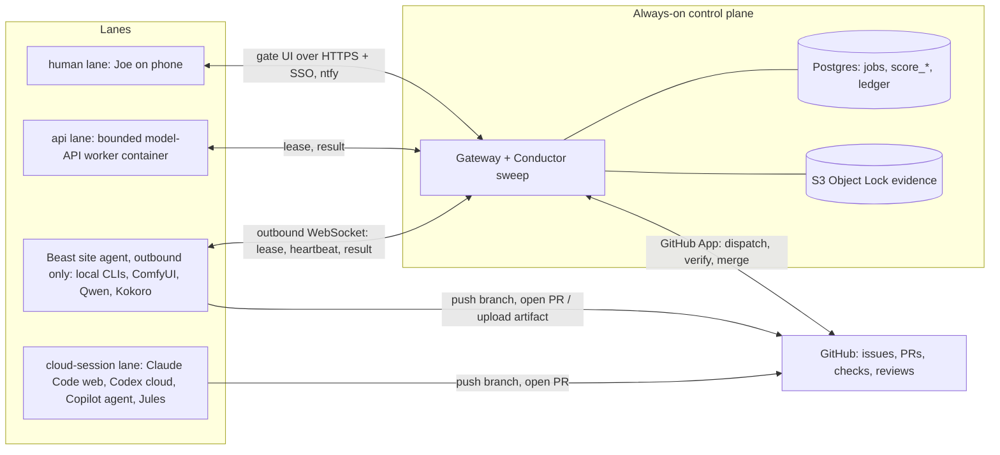

# Score Cloud v2: one conductor in the cloud, many lanes of workers

Status: **design proposal, 2026-09-29.** Nothing here has been built. It does not
issue a grant, start a run, deploy anything or change any existing Score.
`examples/scores/score-cloud-v2.score.json` is a v1-valid Score to build it with
the fleet we already have. That Score passes `mco.orchestrator.scores validate`,
but it has not been run.

Source base: `main` at `ff4374d7f3b9d72ed88ac337990fec39d77f6ab3`.

---

## 1. The finding in one paragraph

The Score kernel is excellent: digest-bound grants, fenced leases, a
transactional outbox, independent review, conductor-owned commits, and proofs
that it holds up under adversarial tests. It shipped real VIA work from
September 19–24 (G02–G04, then the Lorain L- and C-series packets, with
review-and-fix chains). **But the
conductor lives on one Windows desktop, and only one kind of worker can
contribute.** Score state is in SQLite files under `C:/AI/score-runtime/…`. The
sweep runs inside the Beast gateway. `repository:write` requires a local
`worktree_path`, so the most scalable capacity you have can't be scored: Claude
Code on the web, Codex cloud, Copilot's coding agent, Jules, and any direct
model API. When Beast sleeps, reboots or loses Tailscale, every Score stops.
When Beast's CLI credits run out, the Score stalls. When Via CI stopped running
(no run since 2026-09-12), the Score still accepted work and six PRs merged,
because the Score doesn't read CI.

v2 fixes this with three moves:

1. **Move the conductor off Beast**, to an always-on host with Postgres.
2. **Make evidence git-native.** A pull request's exact head SHA, green
   required checks on that SHA, and a review by a different identity replace the
   local `commit_sha` as the unit of acceptance. The conductor, not a person or
   an agent, merges.
3. **Add lanes.** A task says *where* it may run (`local`, `cloud-session`,
   `api` or `human`). Each lane has a thin dispatch adapter, but every lane
   returns the same evidence.

Beast stops being the control plane and becomes one worker *site*: it's where
the GPUs, local models and local-only secrets live.

---

## 2. Gap register (BitCadence)

Ranked by how much each gap blocks "Via runs unattended for seven days without Beast".

| # | Gap | Evidence | Consequence |
|---|---|---|---|
| G1 | Conductor and Score store are Beast-local | `score_bridge.py` and `score_conductor.py` use `sqlite3`; `SCORE-REPAIR-20260920.md` records split recovery DBs (`recovery21`) and `mco stop` hitting the Tailscale listener | Score progress depends on one desktop staying awake |
| G2 | `repository:write` evidence is a conductor-owned commit in a local worktree | `score_adapters_live.verify_git_worktree`, `score_bridge.py:159` | Cloud coding agents can't contribute accepted work |
| G3 | Tests are claims, not receipts | Score has no reader for GitHub check runs; Via CI has made no run since 2026-09-12 while PRs #41–#46 merged | "Accepted" can mean "never ran in CI" |
| G4 | One MCP HTTP bearer = one identity | `mcp_server.bearer_guard` compares one static token | Can't mint per-session, per-task, expiring credentials for cloud sessions |
| G5 | No spend enforcement | Every Score has `budget_cents: 0`; `score_bridge` refuses budgeted tasks; P6/WS4 deferred | An API or media lane would be unmetered |
| G6 | Human gates are reachable only through Beast | Gate console is served by the Beast gateway; ntfy is the only push | A phone approval needs Tailscale up and Beast awake |
| G7 | Merging is out-of-band | Accepted commits are merged later by a person or Codex | Two sources of truth, so docs drift (Via `CURRENT_STATE.md` is dated 09-12; its code moved through 09-24) |
| G8 | Scope sprawl | Since the Chief's read (09-03): jobs ranker, Upwork ingest, projects dashboard, agent exchange, Jev routing hooks | Each is reasonable, but together they compete with G1–G3 for the same 7–10 hours a week |

G8 is a judgment call, not a defect. My view: until G1–G3 land, anything that
doesn't move Via's seven-day clock, or the first paying conversation, waits.

---

## 3. Target architecture



### 3.1 Control plane

- **Store:** Postgres. Port the `score_*` tables and the bridge's transaction
  boundaries from SQLite to the existing Team-edition Postgres path (the
  PostgREST and `mco_lease` RPC contract already exercised in
  `postgres-acceptance.yml`). Keep SQLite for Appliance and development, behind
  one store interface, with a parity suite that runs both.
- **Host:** one small always-on container. Recommended: the existing AWS account
  and `infra/aws` gateway/conductor images on a single t4g.small (SSM only, no
  inbound ports), plus a Cloudflare Tunnel for the public HTTPS that GitHub
  webhooks and cloud sessions need, with Cloudflare Access in front of the
  human console. Store on Supabase or RDS; pick whichever `infra/aws` already
  assumes when C6 starts. Rough baseline: $15–40/month. That's an estimate,
  not a quote.
- **Evidence:** keep the existing locked-S3 sink. Media and other binary
  artifacts go there under the same receipts.

### 3.2 Lanes

A v2 task declares `lanes` (policy: where it *may* run, in preference order)
and `review_lanes`. The conductor picks the first eligible lane that is online,
has capacity (per `USAGE-CAPACITY-SIGNAL.md`), fits the cost ceiling and
satisfies data locality. It emits a **routing receipt** explaining the choice.
Jev may rank candidates, but deterministic code decides eligibility.

| Lane | Dispatch | Returns | Use it for |
|---|---|---|---|
| `local:<role>` | Beast site agent leases the job over an outbound WebSocket; waker starts the CLI in an isolated worktree | Pushed branch + PR (or artifact receipt) | GPU work, local models, Windows-only work, anything whose secrets must stay home |
| `cloud-session:<vendor>` | **GitHub is the universal dispatch surface.** The conductor opens an issue with the signed packet, then triggers the vendor the way that vendor already supports: assign Copilot, mention `@codex`, `@claude` via the Claude GitHub Action, or fire a Claude Code Routine with the packet as text | Draft PR from a `score/<run>/<task>/a<attempt>` branch, linked to the issue | Parallel repo work that doesn't need Beast |
| `api:<provider>` | Conductor-side worker container calls the model API directly | Artifact receipt (JSON, image, audio, video) | Triage, extraction, summaries, image/voice/video generation |
| `human` | Gate UI and ntfy | Authenticated decision record | Launch, spend above cap, anything that is Joe's call |

Every trigger mechanism in the `cloud-session` row must be proven by its own
canary before a Score relies on it. Vendor behavior changes, and this design
deliberately keeps each adapter thin so it's cheap to replace.

**Why GitHub as the dispatch surface:** every cloud coding agent already knows
how to take an issue and return a PR. Vendors change, but the issue→PR→checks
shape stays the same. It keeps BitCadence vendor-neutral, which is the pitch.

### 3.3 Git-native evidence

New evidence kinds, verified server-side through a GitHub App the conductor owns:

- `pull_request`: `{repo, number, head_sha, base_ref, base_sha}`. The conductor
  verifies that the PR author maps to the dispatched lane identity, the base
  equals the packet's `expected_base_sha` (or a descendant permitted by
  policy), changed files are a subset of `allowed_paths`, and the head hasn't
  moved since the evidence was recorded.
- `check_runs:<name>[,<name>…]`: each named check must be `success` **on that
  exact head SHA**, produced by an allowlisted app (GitHub Actions for this
  repo, not a fork or an arbitrary app). "Tests pass" becomes a receipt, not a
  sentence. A missing or never-started run fails closed. That's exactly the
  Via failure since 09-12.
- `review`: a GitHub review or MCO review JSON on the exact head SHA, from an
  identity in a **different vendor family** from the author. Any push after the
  review voids it.
- `artifact`: `{uri, sha256, media_type}` in the evidence store (media, reports).

**Conductor-owned merge** replaces conductor-owned commit. The conductor posts a
required status, `bitcadence/score`, on the head it accepted, and branch
protection requires that status. Then nobody merges unaccepted work into a
Score-governed branch: not an agent, and not you by accident. The Score becomes
the merge gate.

### 3.4 Identity

- One Device Credential per site (Beast, Mac) and per API worker container.
- For `cloud-session`, a **task-scoped, expiring credential** is minted at
  dispatch. It can only lease and complete that one run/task/attempt, expires
  with the attempt, and is delivered in the signed packet or through the
  vendor's secret store. No long-lived master token ever sits in a cloud
  environment.
- `bearer_guard` grows a verifier for these scoped credentials. The single
  static bearer stays for the Appliance edition.
- A GitHub identity map binds bot accounts to lane identities. Separation of
  duty compares vendor family *and* identity, so Codex never reviews Codex.

### 3.5 Keeping local

Beast runs a **site agent**: outbound-only, reconnecting, and fenced by the
existing lease/epoch rules. It advertises capabilities (`gpu:5090`,
`comfyui`, `kokoro`, `qwen-local`, `windows`). Local work also finishes as a
pushed branch and PR, so all repository evidence has one shape. If Beast is
offline, `local`-only tasks wait while everything else keeps moving. Tasks that
list more than one lane fall through automatically, with a routing receipt.

### 3.6 Money

Before the `api` lane gets its first real key, port Via's atomic
reservation pattern: reserve before dispatch, settle on receipt, and keep the
reservation when the outcome is unknown. Add a per-Score monthly ceiling and a
kill switch. Cloud-session cost is mostly subscription seats, so record
sessions and wall time per attempt; the capacity signal handles rate limits.

### 3.7 Gates on the phone

The gate UI moves with the gateway. It sits behind Cloudflare Access (SSO), and
the payload-safe ntfy work from #117 sends the push. Two taps: approve or
reject, bound to the run digest.

---

## 4. Score v2 task shape (additive; v1 still loads)

```json
{
  "id": "V1-ci-revive",
  "goal": "ViaCI",
  "title": "Make Via CI run again and prove it on the merged head",
  "instructions": "…",
  "lanes": ["cloud-session:claude", "local:codex"],
  "review_lanes": ["cloud-session:codex", "local:antigravity"],
  "repo": {
    "name": "mastalink/via",
    "base_ref": "codex/via-foundation",
    "expected_base_sha": "5ea490f182550e909e78323d3a63d000d0b9f35e",
    "allowed_paths": [".github/", "docs/"]
  },
  "evidence": ["pull_request", "check_runs:Verify Via", "review"],
  "merge": {"method": "squash", "checkpoint": null},
  "depends_on": [],
  "resources": ["repo:mastalink/via"],
  "capabilities": ["repository:pr"],
  "max_attempts": 1,
  "timeout_seconds": 7200,
  "max_cost_cents": 0,
  "checkpoint": null
}
```

`role`/`review_role` become optional aliases for `lanes: ["local:<role>"]`, and
`commit.worktree_path` stays valid for the local lane only. The new capability
`repository:pr` covers push-a-branch-and-open-a-PR and is weaker than
`repository:write`: it can never touch a protected branch. Merging is a
conductor effect, not a worker capability.

---

## 5. Build order (each item is one packet in the build Score)

| Packet | Delivers | Proves |
|---|---|---|
| **C0** (human, about 1 hour) | Fix GitHub Actions billing on `mastalink/via`; choose the Postgres host | Via CI runs again (a Verify Via run exists on `codex/via-foundation`) |
| **C1** | Store interface; Postgres Score store; SQLite↔Postgres parity suite | Same event sequence from both stores for the canary and repository-slice fixtures |
| **C2** | GitHub App verifier for `pull_request`, `check_runs` and `review` evidence, **shadow mode** | Replays recent Via PRs #41–#46 and reports what it *would* have refused (no CI run, so refused) |
| **C3** | Scoped task credentials + `bearer_guard` verifier | Expired, replayed and cross-task tokens rejected |
| **C4** | Issue-dispatch lane adapter + one vendor canary | One packet dispatched as an issue, returned as a PR, verified |
| **C5** | Conductor-owned merge + `bitcadence/score` required status | A PR without acceptance can't merge; force-push after review voids acceptance |
| **C6** | Cloud deploy of gateway + conductor + gate UI | `/readyz` green with Beast powered off |
| **C7** | Beast site agent (outbound only) | Local lane leases, loses network, resumes without duplicate effects |
| **C8** | API lane + cost reservations | Reservation atomic under concurrency; unknown outcome keeps its reservation |
| **C9** | Cross-lane canary | One run where a cloud session builds, a local agent reviews and the API lane triages, with Beast switched off mid-run, finishes with a complete evidence trail |

After C9, start Via's seven-day clock on Score Cloud. That run is both Via's MVP
gate and BitCadence's best sales demo: an app built and operated by a governed,
multi-vendor agent fleet, with the ledger to prove it.

## 6. Additions to the adapter acceptance matrix

These are required before live use, on top of `SCORE-V1.md`'s matrix:

- A PR whose author doesn't map to the dispatched lane identity is refused.
- Head SHA changes after review, so review and acceptance are void.
- Changed paths outside `allowed_paths` are refused, including renames and
  deletions.
- A check run from a fork, an unallowlisted app, or a different head SHA is
  ignored. A missing check fails closed.
- Two sessions answering one dispatch: the first valid PR wins and the other is
  closed with a receipt.
- A task credential used after its attempt expires, or for another task, is
  rejected.
- GitHub outage mid-verify: the run pauses; there is no false accept and no
  duplicate merge.
- Human merges during verification: the conductor detects it and records an
  out-of-band merge; it never re-merges.
- Beast offline: local-only tasks wait, and multi-lane tasks fall through with
  a routing receipt.

## 7. What this design does not do

- It doesn't give any worker merge or deploy authority. `cloud:change` stays the
  separate KMS-signed lane from `VIA-SCORE-OPTION-C-20260919.md`.
- It doesn't remove the Appliance edition. SQLite, one box and no cloud account
  remains the free product.
- It doesn't claim any vendor's trigger works until that vendor's canary passes.
