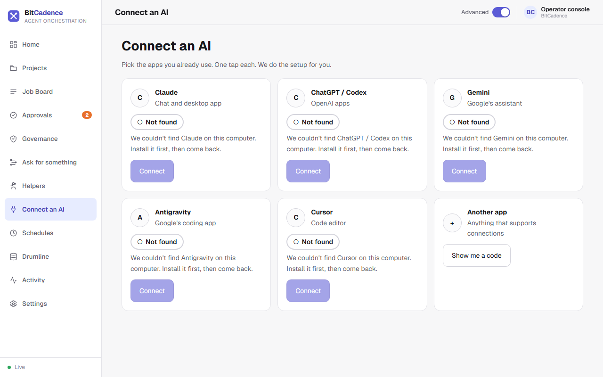

# Connect an AI

Open `/console` and choose **Connect an AI**, or run `bitcadence connect` in a
terminal. Both do the same thing: find the app on this computer and add
BitCadence to its connection settings. You never edit a file.



The screenshot is from a computer with none of these apps installed, so every card says **Not found**. On your computer, a card for an app that is installed has a **Connect** button you can tap.

```
$ bitcadence connect claude
I'll add BitCadence to Claude's settings (a backup is kept).
Go ahead? [Y/n]
Connected. Restart Claude to see it.
```

## Apps

| Say | App |
|---|---|
| `claude` | Claude (chat and desktop app) |
| `codex` | ChatGPT / Codex |
| `gemini` | Gemini |
| `antigravity` | Antigravity |
| `cursor` | Cursor |
| `other` | Any other app: shows a code you can copy |

`bitcadence connect` alone shows a pick list. In the console each app has one
**Connect** button, a **Connected** / **Not connected** / **Not found** word with
a shape (never colour alone), and, once connected, **Send a test** and
**Disconnect**.

## Safe by design

- The original settings file is copied to a `.bak` first. The first backup is
  never overwritten, so repeating connect and disconnect keeps your original.
- A settings file we can't read is left alone, with a plain message.
- Other servers and settings in the file are kept as they were.
- Connecting twice changes nothing. `bitcadence connect claude --disconnect`
  removes only BitCadence.
- `bitcadence connect claude --test` (or **Send a test**) checks that the setting
  is in place and the program it starts exists. Close and reopen the app once.

If the app isn't installed: `I couldn't find Gemini on this computer. Install it,
then run: bitcadence connect gemini`.

The console uses `/api/connect-ai` (list, `/{app}/connect`, `/{app}/disconnect`,
`/{app}/test`). It returns app names and plain sentences only, never a file path
or a sign-in.
