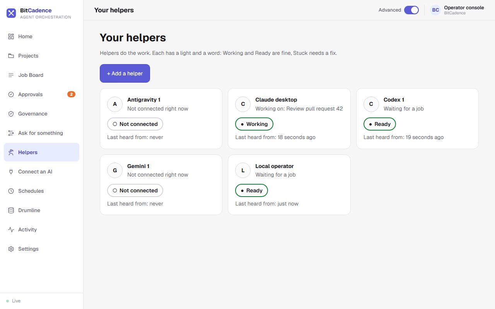
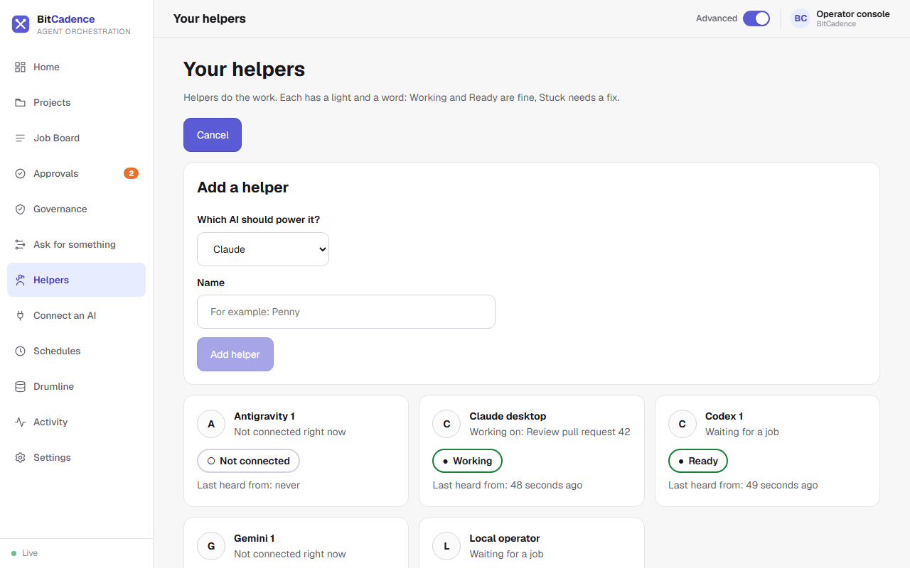

# Helpers & Presence

## Goal
Add a helper, see at a glance which helpers are working, ready or stuck, and rotate a helper's access token. A helper is one AI worker that takes jobs from the board. (The command line still calls them agents, for example `mco agents`.)

---

## Step-by-Step Instructions

### 1. See your helpers
In the left menu, click **Helpers**.



Each helper has a card with a friendly name, a light and a word:
- **Working** (green): it holds a job right now, and the card says which one.
- **Ready** (green): it is waiting for a job.
- **Stuck**: it needs a fix. Click **Fix it** on the card. BitCadence shows what it will do and asks before it does anything.
- **Not connected** (grey): it has not been heard from.

Each card also says when the helper was last heard from. See [Helpers](Helpers.md) for how the lights are decided.

### 2. Add a helper
1. Click **+ Add a helper**.



2. Pick which AI should power it and give it a name, for example *Penny*.
3. Click **Add helper**. BitCadence registers it and saves its sign-in on this computer. The page says "Penny is added" and never shows the sign-in. An existing helper's name is refused instead of silently replacing its sign-in.

To link Claude, Codex, Gemini, Antigravity or Cursor in one tap instead, use [Connect an AI](Connect-an-AI.md).

### 3. Rotate a helper's access token
If a credential is lost or exposed, run `mco reset-token <name>` (see below). A new token is minted and the old one stops working at once.

### 4. Remove a stale helper
Run `mco deregister <name>` to remove its registration.

---

## The CLI Equivalent

```powershell
# List all registered helpers and presence
mco agents

# Register a new helper
mco register --name worker-east-1 --role codex

# Register a helper with restricted scopes
mco register --name monitor-1 --role viewer --scope jobs:read

# Rotate a helper's access token
mco reset-token worker-east-1

# Deregister a helper
mco deregister worker-east-1
```

---

## What You'll See

- **Presence Heartbeats:** When a helper runs `mco listen` or queries `mco_inbox`, its `last_seen_at` timestamp updates automatically.
- **Safe Concurrency:** Two helpers with the same role share the role's inbox. When work arrives, whichever helper requests a lease first wins atomically. The other helper receives an empty response and continues waiting.

---

## If It Goes Wrong

### 1. "Helper shows Not connected despite running"
- **Cause:** Network connectivity lost, or worker polling loop was stopped.
- **Fix:** A helper is considered offline if no heartbeat occurs within 90 seconds. Restart the worker process or verify network reachability to the gateway.

### 2. "Token lost after registration"
- **Cause:** The panel was closed before copying the token.
- **Fix:** Run `mco reset-token <name>` to generate a new token.

### 3. "Cannot delete helper: jobs currently leased"
- **Cause:** The helper is actively holding an open lease on an unfinished job.
- **Fix:** Wait for the job to complete, or use `mco cancel <job-id>` to cancel the leased job before deleting the helper.
