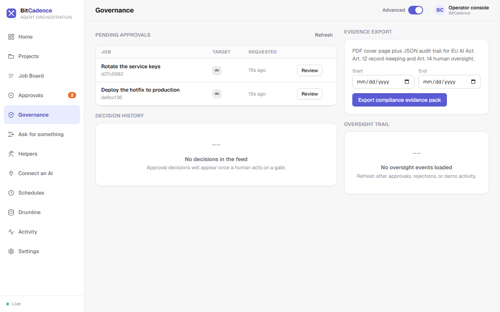

# Approvals & Governance

## Goal
Implement human-in-the-loop oversight, authorize or reject high-risk helper operations at safety gates, trigger the emergency kill switch, and export tamper-evident audit evidence packs.

---

## Step-by-Step Instructions

### 1. Open Approvals
Click **Approvals** in the left menu. The badge next to it shows how many jobs are paused at an approval gate.


### 2. Review a paused job
Pick a job from the list on the left. The panel on the right shows:
- **Title and description:** what the helper wants to do.
- **Will run on:** which helper role would do the work if you say yes.
- **Requested by:** who asked for it.
- **Full details:** opens the job with its history.

### 3. Make a decision
- **To say yes:** click **Approve & run**. The job moves from `needs_approval` to `pending`, a helper can pick it up, and the audit log records who approved it.
- **To say no:** type a reason in **Reason for saying no** and click **Reject**. The job becomes `rejected` and no helper will touch it.
- To handle several at once, tick their boxes or use **Select all**.

The same **Approve** button also appears on **Home** under **What needs you**. See [Approvals](Approvals.md) for how the console checks that you are allowed to approve.

### 4. Pause everything (kill switch)
When something unexpected is happening:
1. Click **Settings**, and in the **Pause everything** card click **Pause**.
   - Helpers stop taking new work and no new jobs are started.
   - Jobs already in progress finish; you can still look, approve and reject.
2. Click **Resume** on the same card to start again.

See [Settings](Settings.md). The `MCO_KILL_SWITCH` setting is the same switch.

### 5. Governance page and evidence export
Click **Governance** for the pending approvals, the decision history and the oversight trail in one place.



To export evidence, pick a **Start** and **End** date and click **Export compliance evidence pack**. You get a PDF cover page plus a JSON audit trail for EU AI Act Art. 12 record-keeping and Art. 14 human oversight.

---

## The CLI Equivalent

```powershell
# Approve a job at the human gate
mco approve <job-id>

# Reject a job with recorded rationale
mco reject <job-id> --reason "Production deployment window closed"

# View tamper-evident event history
mco audit <job-id>

# Export a signed cryptographic audit checkpoint
mco audit-checkpoint <job-id> checkpoint.json

# Enable emergency kill switch from terminal
mco settings MCO_KILL_SWITCH true
mco restart
```

---

## What You'll See

- **Immutable History:** In the database (`agent_job_events`), every approval decision is written to an append-only table. Any database `UPDATE` or `DELETE` query on this table is rejected at the storage engine level.
- **Audit Receipt:** In the job's details, the history explicitly stamps:
  ```text
  approved · actor: local-operator (role: admin) · 2026-10-03 12:25:00 UTC
  ```

---

## If It Goes Wrong

### 1. "403 Forbidden: Approver role required"
- **Cause:** The bearer token used to approve the job belongs to a role that is not listed in `MCO_APPROVER_ROLES`.
- **Fix:** By default, approver roles are `human,admin,operator`. Re-authenticate with an admin or human token, or configure:
  ```powershell
  mco settings MCO_APPROVER_ROLES "human,admin,operator,reviewer"
  ```

### 2. "Kill switch active: Cannot lease task"
- **Cause:** The kill switch was left enabled (`MCO_KILL_SWITCH=true`).
- **Fix:** On **Settings**, click **Resume** in the **Pause everything** card, or run:
  ```powershell
  mco settings MCO_KILL_SWITCH false
  ```
