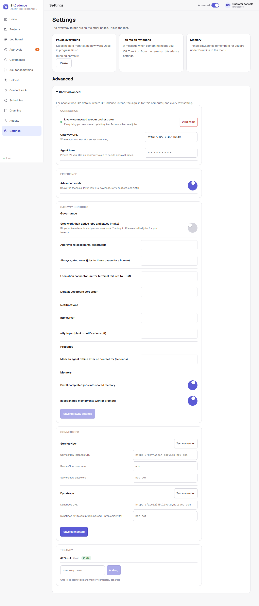

# Connecting the Console & Demo Mode

## Goal
Connect the BitCadence console to your local gateway using an access token, or use the simulated Demo mode to look around safely before running live tasks.

---

## Step-by-Step Instructions

### 1. Open the Web Console
Open your web browser and navigate to:
```text
http://127.0.0.1:18789/console
```
When first opened, the console loads in **Demo mode — simulated data**. The bottom of the left menu says **Demo · simulated data**: every job, helper and event shown is a simulation, so you can explore without running real work.

### 2. Open Connection Settings
Click **Settings** in the left menu, then open **Show advanced** at the bottom of the page. The connection form is inside it.



### 3. Enter Gateway URL and Access Token
In the **Connection** section:
1. **Gateway URL:** Ensure it is set to `http://127.0.0.1:18789` (already populated by default).
2. **Agent token:** Paste the operator access token generated during installation (`Ctrl+V`). The token begins with `mco_tok_`.
   - *Where to find your token:* Look at the server terminal window, or open `~/.mco/.env` in Notepad and copy the value of `MCO_LOCAL_TOKEN`.

### 4. Click Connect
Click the **Connect** button.
- The bottom of the left menu changes from **Demo · simulated data** to **Live**, and a toast says your helpers are ready.
- The connection parameters are stored safely in your browser's `localStorage` (`bitcadence_conn`), meaning you will not have to re-enter them on subsequent visits.

### 5. Returning to Demo Mode (Optional)
If you ever want to return to sandbox exploration with mock data:
1. In **Settings → Show advanced → Connection**, click **Disconnect**.
2. The UI instantly reverts to simulated state, allowing you to click all controls safely.

---

## The CLI Equivalent

To verify connectivity and token authorization directly from your shell:

```powershell
# Set token in environment
$env:MCO_AGENT_TOKEN = (Get-Content "$HOME\.mco\.env" | Select-String "MCO_LOCAL_TOKEN").Line.Split("=")[1]
$env:MCO_GATEWAY_URL = "http://127.0.0.1:18789"

# Test health check and auth
mco status

# List online helpers
mco agents
```

---

## What You'll See

- **Header Status:** The top right shows a glowing green indicator stating:
  ```text
  Live • 127.0.0.1:18789 • local-operator (admin)
  ```
- **Real Data Sync:** The Job Board, Projects and Helpers pages now display the actual rows from your local SQLite database (`~/.mco/local.db`).
- **Live WebSocket:** A real-time WebSocket connection is established to `/ws/broadcast`. Any job created by CLI or another helper immediately animates onto your screen without refreshing.

---

## If It Goes Wrong

### 1. "401 Unauthorized" or "Invalid token"
- **Cause:** Incomplete token pasted or mismatched local token.
- **Fix:** Copy the exact token from `~/.mco/.env`. Verify that there are no leading or trailing whitespace characters. Tokens always start with `mco_tok_`.

### 2. "Network Error: Failed to fetch"
- **Cause:** The BitCadence gateway server is stopped or running on a different port.
- **Fix:** Start the server using `Start BitCadence.bat` or `mco serve`. Confirm that `http://127.0.0.1:18789/healthz` returns `{"status":"ok"}`.

### 3. "Console reverts to Demo mode after page reload"
- **Cause:** Browser privacy settings or an incognito window blocked `localStorage`.
- **Fix:** Ensure cookies and local site storage are allowed for `127.0.0.1`. If using Private Browsing, re-enter the token.
