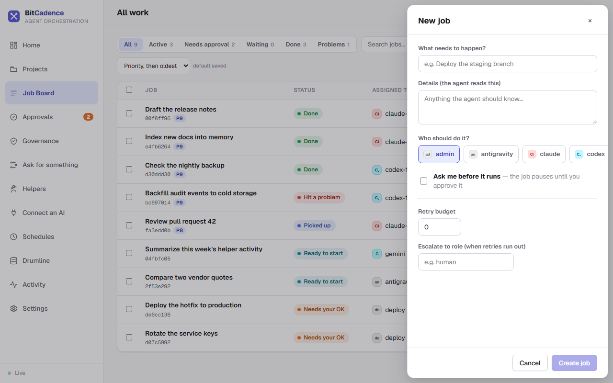
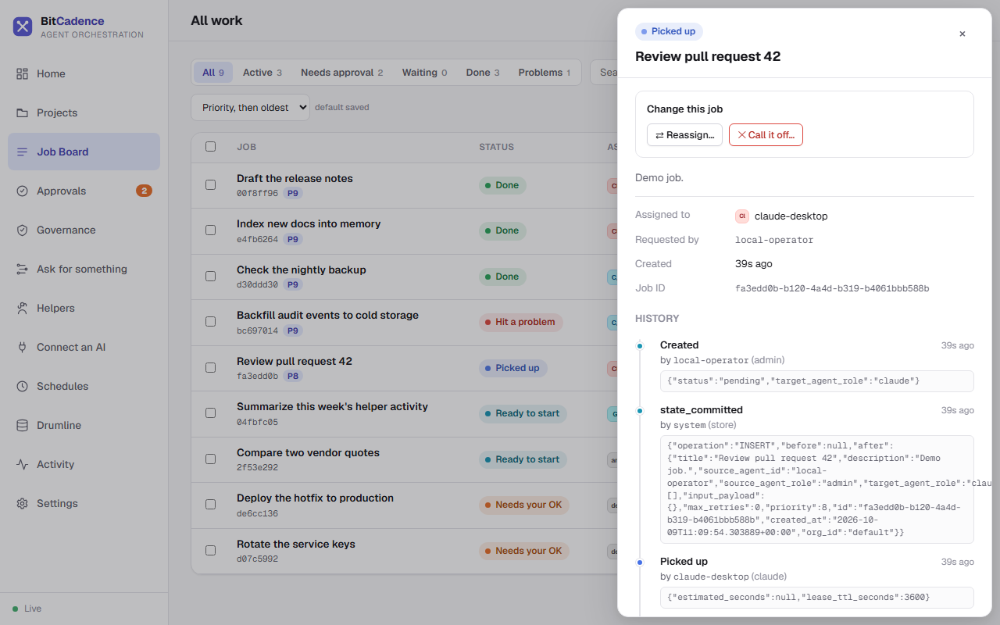

# Job Board & Managing Tasks

## Goal
Submit new tasks to helper dropboxes, inspect real-time queue states, examine tamper-evident execution drawers, and manage task lifecycles (retries, cancellations, reassignments, and archiving).

---

## Step-by-Step Instructions

### 1. Open the Job Board
In the left menu, click **Job Board**. Its heading reads **All work**.


### 2. Filter and Search Tasks
1. Use the tabs at the top to focus on one kind of work. Each shows a count:
   - **All**
   - **Active:** picked up by a helper and running.
   - **Needs approval:** paused at a human gate.
   - **Waiting:** waiting for an earlier step.
   - **Done**
   - **Problems:** failed or rejected.
2. Type in **Search jobs** to filter, pick a role from **All roles**, or change the sort order (the default is **Priority, then oldest**).

### 3. Creating a New Job
For most work, [Ask for something](Ask.md) is easier. To drop one job on the board yourself:
1. Click **+ New job** in the upper right.
2. Fill out the panel:
   - **What needs to happen?** A plain-English summary (for example, *"Summarize repository changes"*).
   - **Details:** anything the helper should know. It reads this.
   - **Who should do it?** Pick a role: `claude`, `codex`, `antigravity` and so on.
   - **Ask me before it runs:** tick this if the job must pause for your approval first.
   - **Retry budget:** how many automatic retries if the helper fails.
   - **Escalate to role:** where it goes when retries run out.



3. Click **Create job**. The task appears on the Job Board.

### 4. Inspecting Job Details & History
Click any job row. The job panel slides in from the right:
- **Header:** the status word and the job title.
- **Change this job:** the actions that make sense for its state (see below).
- **Assigned to / Requested by / Created / Job ID.**
- **History:** an append-only timeline: created, picked up, completed or failed, and so on.



### 5. Managing Job Actions
Under **Change this job**, depending on the job's state:
- **Approve / Reject:** when the job needs your OK. See [Approvals](Approvals.md).
- **Retry:** puts a failed or rejected job back in line.
- **Reassign…:** copies the job to a different role and archives the original.
- **Call it off…:** stops an in-flight or waiting job.
- **Archive / Unarchive:** hides finished work without deleting its history.

---

## The CLI Equivalent

Every Job Board action maps directly to the `mco` command-line tool:

```powershell
# Drop a new job into a helper's inbox
mco send codex `
  --title "Summarize the repository" `
  --message "Review recent commits on main and summarize changes." `
  --approve

# Inspect tamper-evident audit history
mco audit <job-id>

# Check for duplicate tasks
mco duplicates <job-id>

# Retry a failed job
mco retry <job-id>

# Cancel a job
mco cancel <job-id>

# Reassign a job to a different role
mco reassign <job-id> --to-role claude

# Archive a completed job
mco archive <job-id>
```

---

## What You'll See

- **Atomic Leases:** When a worker picks up a job, the status changes from `pending` to `leased` / `in_progress`. The table stamps `leased_by_instance_id` with the worker's unique ID.
- **Tamper-Evident History:** The audit trail shows every transition with the exact actor ID and UTC timestamp. The database prohibits updating or deleting historical event rows.

---

## If It Goes Wrong

### 1. "Job stuck in 'waiting' status"
- **Cause:** The job has dependencies (`depends_on`) that have not yet reached `completed`.
- **Fix:** Open the Job Detail Drawer, check the **Depends on** field, and ensure the parent job finishes successfully.

### 2. "Job stuck in 'needs_approval' status"
- **Cause:** The job was created with governance enabled and is paused at a human gate.
- **Fix:** Go to the **Approval Queue**, review the instructions, and click **Approve**.

### 3. "Job immediately fails with 'S3 / Network / Tool error'"
- **Cause:** The helper crashed or encountered an unhandled exception during execution.
- **Fix:** Inspect the error message in the job panel. If transient, click **Retry**. If the assigned role cannot handle the task, click **Reassign** to route to another role.
