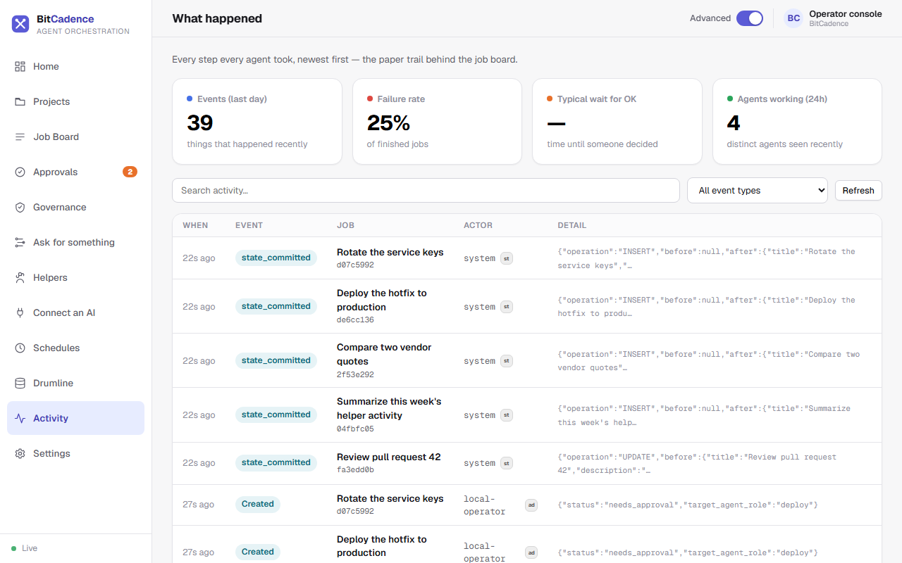
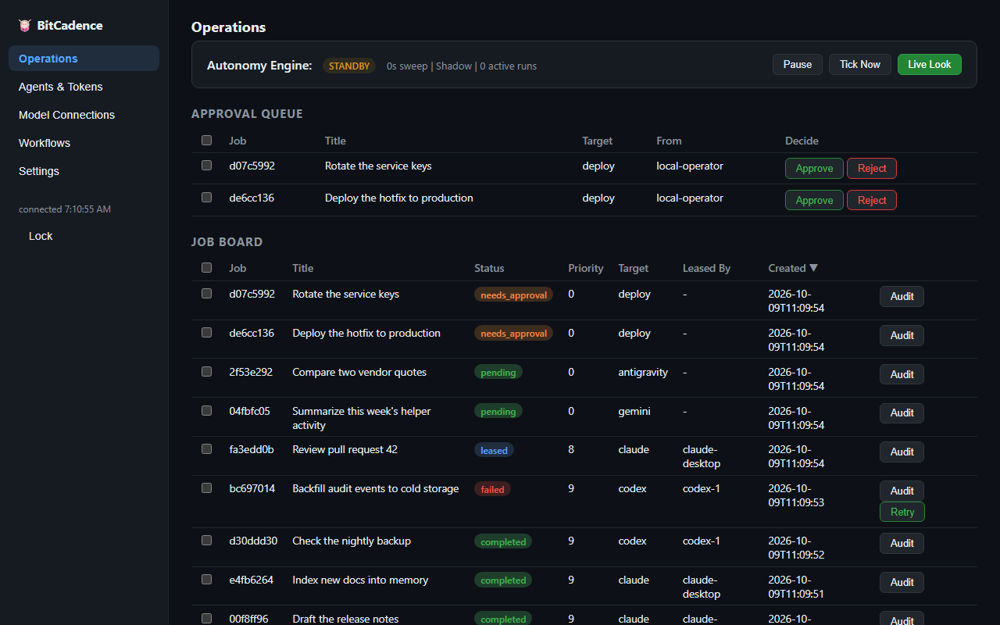

# Home (Overview)

## Goal
See what needs you and what is running from one screen, without reading a job list. Home replaced the old Overview and its metric cards.

---

## Step-by-Step Instructions

### 1. Open Home
Click **Home** at the top of the left menu. It is the first page the console opens.


### 2. Read "What needs you"
This comes first. Each card is one thing waiting on a person, with a count beside the heading:
- **Needs you:** a job paused for your approval. Click **Approve** to say yes, or **Look first** to read the details.
- **Stuck:** work that failed or has gone quiet. Click **Look first**.

### 3. Read "What's running"
Below that, each card is one piece of work in flight, with a state word (**Working**, **Waiting**) and a plain sentence such as *Waiting for a free helper* or *claude is working on this step*. Steps of the same plan are grouped, and a Score run shows as one card. Click a card for more. **See all work** opens the job board.

Home refreshes by itself and shows recent work only. See [Console Home](Console-home.md) for the exact rules, including when a job is called **Stuck**.

### 4. Look at the rest of the menu
The left menu also has [Projects](projects-dashboard.md), the [Job Board](job-board-and-tasks.md), [Approvals](Approvals.md), Governance, [Ask for something](Ask.md), [Helpers](Helpers.md), [Connect an AI](Connect-an-AI.md), [Schedules](Schedules.md), Drumline, **Activity** and [Settings](Settings.md). **Activity** shows every step every helper took, newest first, with event, failure and helper counts.



### 5. The minimal dashboard
`/dashboard` is a smaller, plainer page for a quick look. It asks for a token first, and still uses the technical labels (Operations, Agents & Tokens).



### 6. Advanced mode
The **Advanced** switch in the top bar shows the technical layer (raw IDs, payloads, retry budgets). Leave it off for plain wording.

---

## The CLI Equivalent

To obtain a quick operational snapshot from your terminal:

```powershell
# Health check and diagnostic summary
mco status

# List all helpers and their online presence
mco agents
```

---

## What You'll See

- **Live updates:** Cards move between **What needs you** and **What's running** as helpers pick up and finish jobs.
- **Failure alerts:** A job that fails with no retries left appears under **What needs you** as **Stuck**.
- **Demo mode:** Before you connect, the bottom of the left menu says **Demo · simulated data** and the cards are examples.

---

## If It Goes Wrong

### 1. "Home looks out of date"
- **Cause:** The connection to the gateway was interrupted.
- **Fix:** Check the status at the bottom of the left menu: it should say **Live**. If it does not, refresh the browser page (`F5`).

### 2. "No helpers are working"
- **Cause:** No background helpers or daemon listeners are running.
- **Fix:** Start helpers in the Desktop Manager, or launch a listener from a terminal:
  ```powershell
  mco listen --role codex --instance worker-1
  ```
