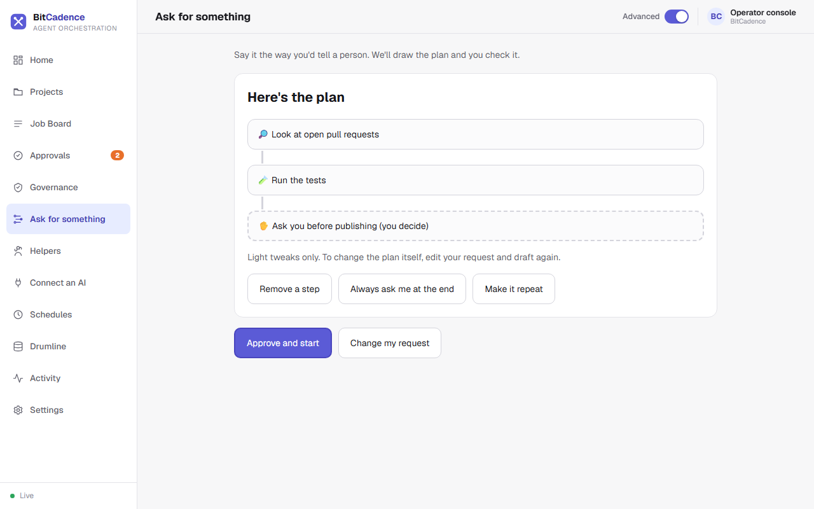
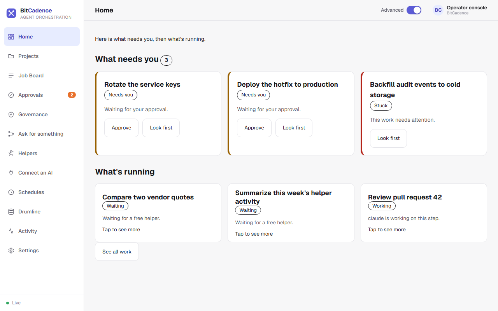

# Workflow Files

## Goal
Run a multi-step pipeline from a saved YAML workflow file, with each step waiting for the one before it. For most work you don't need a file: say what you want on the **Ask for something** page and approve the plan it draws. See [Ask](Ask.md).

> The drag-and-drop workflow builder and the Flow Control page (`/flow`) were removed from the console. **Ask for something** replaced them, and **Home** shows what is running. A workflow file is still the right tool when you want to keep a pipeline in version control and re-run it.

---

## Step-by-Step Instructions

### 1. The easy way: Ask
1. In the left menu, click **Ask for something**.
2. Type the request the way you'd tell a person, then click **Draft a plan**.



3. Check the steps. Use **Remove a step**, **Always ask me at the end** or **Make it repeat** for light tweaks.
4. Click **Approve and start**. The steps appear on the job board as linked jobs, and **Home** shows them under **What's running**.

### 2. Watching a pipeline
Click **Home**. Steps that wait on an earlier step show **Waiting**, a step that needs you shows **Needs you** with an **Approve** button, and a step that failed shows up under **What needs you**.



---

## The CLI Equivalent

A saved pipeline is a YAML file:

```yaml
# pipeline.yaml
name: release-pipeline
steps:
  - id: research
    role: claude
    title: Research open bugs
    instructions: Identify critical bugs targeted for the v2.4 release.
  - id: fix
    role: codex
    title: Implement fixes
    instructions: Apply fixes identified in the research step.
    depends_on: [research]
  - id: ship
    role: codex
    title: Tag release
    instructions: Tag v2.4 release and publish artifacts.
    depends_on: [fix]
    requires_approval: true
```

Run the workflow:
```powershell
mco workflow pipeline.yaml
```

---

## What You'll See

- **Automatic Context Threading (Drumline):** When step 2 (`fix`) executes, BitCadence automatically prefixes its prompt with the **WORKFLOW THREAD** block containing the verbatim decisions and files from step 1 (`research`). No context is lost between different models.
- **Automatic Gating:** When step 3 (`ship`) is reached, it automatically stops at `needs_approval` and waits for human sign-off.

---

## If It Goes Wrong

### 1. "Cyclic dependency detected"
- **Cause:** Step A depends on Step B, and Step B depends on Step A.
- **Fix:** Remove the circular reference in the YAML file. Workflows must be strict Directed Acyclic Graphs (DAGs).

### 2. "Downstream steps fail after upstream failure"
- **Cause:** By default, dependent steps remain `waiting` if an upstream parent fails.
- **Fix:** Open the failed parent job, click **Retry**, or use `mco retry <parent-id>`. Once the parent succeeds, downstream steps unlock automatically.
